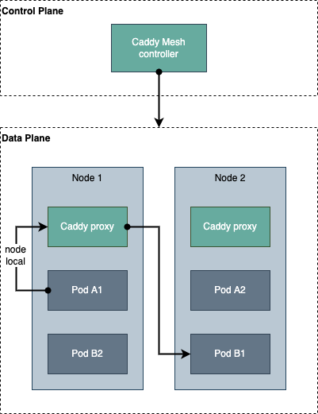

# Caddy Mesh

Caddy service mesh based on [the host/node architecture][1].





## Features

- [x] [Timeouts](#timeouts)
- [x] [Retries](#retries)
- [ ] Circuit Breaking
- [x] [Rate Limiting](#rate-limiting)
- [x] [Traffic Splitting](#traffic-splitting)


## Installation

### Prerequisites

Build the image for Caddy Mesh controller:

```console
$ make build-image tag=v0.1.0
```

If using any plugins, you need to build the Caddy image locally:

```console
$ make build-caddy-image tag=2.6.0-beta.3-custom
```

### Install the Helm Chart

```console
$ make helm-install
```


## Configuration

All features provided by Caddy Mesh can be enabled by using [annotations][2] on Kubernetes services.

### Timeouts

Timeouts can be enabled by using the following annotation:

```
mesh.caddyserver.com/timeout-dial-timeout: 10s
mesh.caddyserver.com/timeout-read-timeout: 10s
mesh.caddyserver.com/timeout-write-timeout: 10s
```

### Retries

Retries can be enabled by using the following annotation:

```
mesh.caddyserver.com/retry-count: "2"
mesh.caddyserver.com/retry-duration: 5s
mesh.caddyserver.com/retry-on: path('/foo/*')
```

### Rate Limiting

Rate Limiting can be enabled by using the following annotation:

```
mesh.caddyserver.com/rate-limit-key: "{query.id}"
mesh.caddyserver.com/rate-limit-rate: 2r/s
```

Note that this feature requires the [caddy-ext/ratelimit](https://github.com/RussellLuo/caddy-ext/tree/master/ratelimit) plugin.

### Traffic Splitting

Traffic splitting can be enabled by using the following annotation:

```
mesh.caddyserver.com/traffic-split-expression: "header({'User-Agent': '*Chrome*'})"
mesh.caddyserver.com/traffic-split-new-service: server-v2
mesh.caddyserver.com/traffic-split-old-service: server-v1
```

#### Workflow

(This workflow is inspired by [SMI TrafficSplit][3].)

In this example workflow, the user has previously created the following resources:

- Deployment named `server-v1`, with labels: `app: server` and `version: v1`.
- Service named `server`, with a selector of `app: server`.
- Service named `server-v1`, with selectors: `app: server` and `version: v1`.
- Clients use the FQDN of `server` to communicate.

In order to update an application, the user will perform the following actions:

- Enable Traffic splitting on `server` (without redirecting traffic to `server-v2`).

    ```diff
    ---
    kind: Service
    apiVersion: v1
    metadata:
      name: server
      labels:
        app: server
    + annotations:
    +   mesh.caddyserver.com/trafficsplit-expression: "false"
    +   mesh.caddyserver.com/trafficsplit-new-service: server-v2
    +   mesh.caddyserver.com/trafficsplit-old-service: server-v1
    spec:
      ...
    ```
  
- Create a new deployment named `server-v2`, with labels: `app: server` and `version: v2`.
- Create a new service named `server-v2`, with selectors: `app: server` and `version: v2`.
- Once the deployment is healthy, spot check by sending manual requests to the `server-v2`.

When ready, the user begins to redirect traffic to `server-v2`:

- For example, the user first route Chrome consumers to `server-v2`:

    ```diff
    ---
    kind: Service
    apiVersion: v1
    metadata:
      name: server
      labels:
        app: server
      annotations:
    -   mesh.caddyserver.com/trafficsplit-expression: "false"
    +   mesh.caddyserver.com/trafficsplit-expression: "header({'User-Agent': '*Chrome*'})"
        mesh.caddyserver.com/trafficsplit-new-service: server-v2
        mesh.caddyserver.com/trafficsplit-old-service: server-v1
    spec:
      ...
    ```
  
- Verify health metrics and become comfortable with the new version.
- The user decides to redirect all traffic to the new version:

    ```diff
    ---
    kind: Service
    apiVersion: v1
    metadata:
      name: server
      labels:
        app: server
      annotations:
    -   mesh.caddyserver.com/trafficsplit-expression: "header({'User-Agent': '*Chrome*'})"
    +   mesh.caddyserver.com/trafficsplit-expression: "true"
        mesh.caddyserver.com/trafficsplit-new-service: server-v2
        mesh.caddyserver.com/trafficsplit-old-service: server-v1
    spec:
      ...
    ```

When completed, cleanup the old resources:

- Delete the old `server-v1` deployment.
- Delete the old `server-v1` service.
- Remove the Traffic splitting annotations as it is no longer needed.


[1]: https://traefik.io/glossary/service-mesh-101/
[2]: https://kubernetes.io/docs/concepts/overview/working-with-objects/annotations/
[3]: https://github.com/servicemeshinterface/smi-spec/blob/main/apis/traffic-split/v1alpha4/traffic-split.md#workflow
