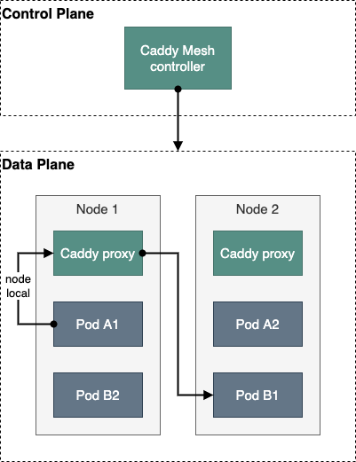

# Caddy Mesh

Caddy service mesh based on [the host/node architecture][1].





# Installation

```console
$ make build-image tag=v0.1.0
$ make helm-install
```


[1]: https://traefik.io/glossary/service-mesh-101/
